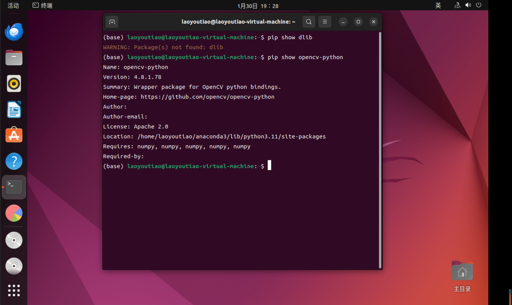
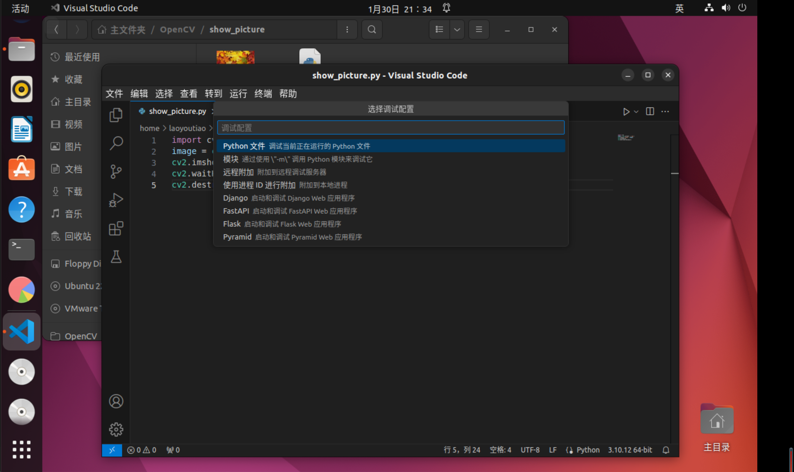

### 1.5 快速上手OpenCV图片处理  


#### 1.5.1 图像显示  

用imread函数载入图像存储数据结构Mat类
用imshow函数显示  

```cpp
#include <opencv2/opencv.hpp>
using namespace cv; //包含cv命名空间  

int main()
{
    Mat Image = imread("./maple_leaf.jpg");  //载入图片
    imshow("origin_picture",Image); //显示图片
    waitKey(0); //等待任意按键按下，使窗口保持在那里
}
```

输入命令  
```
g++ show_picture.cpp -o show_picture `pkg-config --cflags --libs opencv`
./show_picture
```

效果图
 


#### 1.5.2 图像腐蚀  

最基本的形态学运算之一————腐蚀  
用暗色部分腐蚀掉高亮部分  

```cpp
#include <opencv2/highgui/highgui.hpp> //highgui模块头文件
#include <opencv2/imgproc/imgproc.hpp> //OpenCV图像处理头文件 
using namespace cv; //包含cv命名空间  

int main()
{
    Mat srcImage = imread("./maple_leaf.jpg");  //载入图片
    imshow("origin_picture",srcImage); //显示图片

    Mat element = getStructuringElement(MORPH_RECT,Size(15,15));
    Mat dstImage;
    erode(srcImage, dstImage, element);

    imshow("已腐蚀",dstImage);

    waitKey(0); //等待任意按键按下，使窗口保持在那里
}
```

```
g++ eroded_picture.cpp -o eroded_picture `pkg-config --cflags --libs opencv`
./eroded_picture
```

效果图



#### 1.5.3 图像模糊  

均值滤波  

```cpp
#include "opencv2/highgui/highgui.hpp"
#include "opencv2/imgproc/imgproc.hpp"
using namespace cv;

int main()
{
    Mat srcImage = imread("./maple_leaf.jpg");
    imshow("origin_picture", srcImage);
    Mat dstImage;
    blur(srcImage, dstImage, Size(7,7));
    imshow("blured_picture", dstImage);
    waitKey(0);
}
```