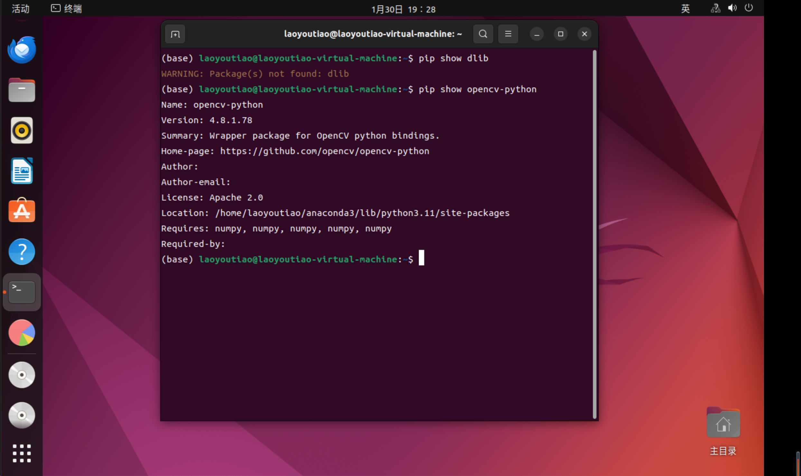

# OpenCV (分别使用C++语言和python语言实现)  

## 准备工作


### 任务清单：  
1、下载一张图片，使用imread读取，然后用imshow显示图片，了解如何改变输出图像的大小，并让图像分别完整显示在显示器的四个角。  
2、了解OpenCV处理单个像素和通道的方法，将一张彩色图片每个像素的RGB值改为三通道均值average。  
3、了解threshold函数原理，并手动实现，即在任务二的基础上，在最前面声明一个变量，遍历每一个像素，当average值大于变量值时设为255，反之为0，观察不同变量值处理结果。  
4、了解深拷贝与浅拷贝的区别，分别对同一图像进行深浅拷贝，并对拷贝后的图像进行任务三的处理，观察两者有什么区别。  
5、了解通道分离，将同一张彩色图片的三个通道分别分离。  
6、了解Gamma矫正原理（为什么、怎么做），并手动实现，使用图片见图6-1、6-2。  
7、了解HSV意义，将图片转化到HSV色域，并用inRange分别提取一张复杂彩色图片中红色和蓝色像素的部分，并思考在不同光线下参数应该怎么改。  

### 下载OpenCV：
手动安装源代码  
更新软件和软件源  
```
sudo apt-get update 
sudo apt-get upgrade 
```
安装依赖库  
```
sudo apt-get install build-essential libgtk2.0-dev libgtk-3-dev libavcodec-dev libavformat-dev libjpeg-dev libswscale-dev libtiff5-dev
```
下载OpenCV源代码,从官网上下载source文件  
将文件解压缩到Codes文件夹中，并重命名为opencv  
进入到下载好的opencv目录中，新建目录build并进入build目录  
```
cd opencv
mkdir build
cd build
```
编译debug模式opencv库文件  
```
cmake -D CMAKE_BUILD_TYPE=Debug -D OPENCV_GENERATE_PKGCONFIG=YES -D CMAKE_INSTALL_PREFIX=/usr/local/OpenCV/Debug -D WITH_FFMPEG=ON ..
```  
编译安装OpenCV，使用make编译  
```
make -j8
```
使用make安装  
```
sudo make install
```

:x:安装过程中出错了,报错设备上空间不够，但是我明明划了100GB的磁盘空间  

打开磁盘资源管理器，看一下是根文件夹不足，为什么主文件夹只有2.7GB  
下载安装gparted来进行磁盘管理  
```
sudo apt update
sudo apt install gparted
```
打开gparted
```
sudo gparted
```
通过gparted发现又80GB的空间未分配，尝试扩大主文件夹，报错  
```
unable to resize read-only file system /dev/sda3
The file system can not be realized while it is mounted read-only.
Either unmount the file system or remount it read-write
```
无法调整只读文件系统/dev/sda3的大小  
使用lsof命令来检查确认没有任何正在使用/dev/sda3文件系统的进程  
```
sudo lsof | grep /dev/sda3
```
使用umount命令来卸载/dev/sda3文件系统：
```
sudo umount /dev/sda3
```
使用mount命令将/dev/sda3文件系统重新挂载为读写模式
```
sudo mount -o remount,rw /dev/sda3
```
然后通过gparted扩大主文件夹  
成功了成功了成功了！:o::laughing::laughing::laughing:  


环境配置  
打开/etc/ld.so.conf  
```
sudo gedit /etc/ld.so.conf
```
在文件中加上一行  
```
include /usr/local/lib
```
加入缓存  
```
 sudo ldconfig
```
打开 /etc/bash.bashrc 文件  
```
sudo gedit /etc/bash.bashrc
```
末尾加上  
```
PKG_CONFIG_PATH=$PKG_CONFIG_PATH:/usr/local/lib/pkgconfig
export PKG_CONFIG_PATH
```
再输入命令  
```
source /etc/bash.bashrc
```
检验  
```
pkg-config opencv --modversion
```
会出现opencv的版本  
:x:但是报错:dizzy_face:  
```
Package opencv was not found in the pkg-config search path.
```
创建pkgconfig文件
```
cd /usr/local/lib
 
sudo mkdir pkgconfig
cd pkgconfig
sudo touch opencv.pc
sudo vim opencv.pc
```
进入vim模式插入代码   :qa! 不保存退出  :wq  保存退出
```
prefix=/usr/local
exec_prefix=${prefix}
includedir=${prefix}/include
libdir=${exec_prefix}/lib
 
Name: opencv
Description: The opencv library
Version:4.8.0
Cflags: -I${includedir}/opencv4
Libs: -L${libdir} -lopencv_shape -lopencv_stitching -lopencv_objdetect -lopencv_superres -lopencv_videostab -lopencv_calib3d -lopencv_features2d -lopencv_highgui -lopencv_videoio -lopencv_imgcodecs -lopencv_video -lopencv_photo -lopencv_ml -lopencv_imgproc -lopencv_flann  -lopencv_core
```
检验:o:  
```
pkg-config opencv --modversion
```
转到 opencv-4.5.2/sample/cpp/example_cmake 目录下，打开终端  
```
cmake .
make
./opencv_example
```
转到 opencv-4.5.2/sample/cpp/example_cmake 目录下，打开终端  
```
cmake .
make
./opencv_example
```
"Hello,OpenCV"安装成功:laughing:  

  

### 下载dlib：  
```c
pip install cmake  -i https://pypi.tuna.tsinghua.edu.cn/simple
pip install boost  -i https://pypi.tuna.tsinghua.edu.cn/simple
pip install dlib  -i https://pypi.tuna.tsinghua.edu.cn/simple
```
没了，安装dlib还挺顺利的  

### vscode配置C++环境  

安装vscode，没什么好说的
输入指令sudo apt-get install vim安装vim
sudo apt install g++安装g++
安装汉化、C\C++插件  

### 上传github 

之前一直放着没有解决的问题出现报错了  
当本地文件和github上的文件不一致时，push和pull时会报错  
```
$ git push -u origin main
To github.com:YuanJieMaster/Computer_Vision.git
 ! [rejected]        main -> main (non-fast-forward)
error: failed to push some refs to 'github.com:YuanJieMaster/Computer_Vision.git'
hint: Updates were rejected because the tip of your current branch is behind
hint: its remote counterpart. If you want to integrate the remote changes,
hint: use 'git pull' before pushing again.
hint: See the 'Note about fast-forwards' in 'git push --help' for details.

$ git pull origin main
From github.com:YuanJieMaster/Computer_Vision
 * branch            main       -> FETCH_HEAD
fatal: refusing to merge unrelated histories
```

解决方法：忽略差异，强制上传  
比较暴力，但是有用，这一块还值得研究，以后再说，先赶进度  
```
git pull origin main --allow-unrelated-histories

git push -u origin main
```

### 备注  

:robot::表示是ChatGPT写的  
:keyboard::表示是手打的


## OpenCV学习笔记  

### 1 基本OpenCV图片处理  


#### 1.1 图像显示  

用imread函数载入图像存储数据结构Mat类
用imshow函数显示  
:keyboard:
```cpp
#include <opencv2/opencv.hpp>
using namespace cv; //包含cv命名空间  

int main()
{
    Mat Image = imread("./maple_leaf.jpg");  //载入图片
    imshow("origin_picture",Image); //显示图片
    waitKey(0); //等待任意按键按下，使窗口保持在那里
}
```

输入命令  
```
g++ show_picture.cpp -o show_picture `pkg-config --cflags --libs opencv`
./show_picture
```

效果图
 


#### 1.2 图像腐蚀  

最基本的形态学运算之一————腐蚀  
用暗色部分腐蚀掉高亮部分  
:keyboard:
```cpp
#include <opencv2/highgui/highgui.hpp> //highgui模块头文件
#include <opencv2/imgproc/imgproc.hpp> //OpenCV图像处理头文件 
using namespace cv; //包含cv命名空间  

int main()
{
    Mat srcImage = imread("./maple_leaf.jpg");  //载入图片
    imshow("origin_picture",srcImage); //显示图片

    Mat element = getStructuringElement(MORPH_RECT,Size(15,15));
    Mat dstImage;
    erode(srcImage, dstImage, element);

    imshow("已腐蚀",dstImage);

    waitKey(0); //等待任意按键按下，使窗口保持在那里
}
```

```
g++ eroded_picture.cpp -o eroded_picture `pkg-config --cflags --libs opencv`
./eroded_picture
```

效果图


#### 1.3 图像模糊  

均值滤波  
:keyboard:
```cpp
#include "opencv2/highgui/highgui.hpp"
#include "opencv2/imgproc/imgproc.hpp"
using namespace cv;

int main()
{
    Mat srcImage = imread("./maple_leaf.jpg");
    imshow("origin_picture", srcImage);
    Mat dstImage;
    blur(srcImage, dstImage, Size(7,7));
    imshow("blured_picture", dstImage);
    waitKey(0);
}
```

输入命令  
```
g++ blured_picture.cpp -o blured_picture `pkg-config --cflags --libs opencv`
./blured_picture
```

效果图  


#### 1.4 边缘检测  
:keyboard:
```cpp
#include <opencv2/opencv.hpp>
#include <opencv2/imgproc/imgproc.hpp>
using namespace cv;

int main()
{
    Mat srcImage = imread("./maple_leaf.jpg");
    imshow("origin_picture", srcImage);
    Mat dstImage, edge, grayImage;

    //创建与src同类型和大小的矩阵
    dstImage.create( srcImage.size(), srcImage.type());

    //转灰
    cvtColor( srcImage, grayImage, COLOR_BGR2GRAY ); //按OpenCV3的来

    blur( grayImage, edge, Size(3,3) );

    Canny(edge, edge, 3, 9, 3); //运行Canny

    imshow("Cannied_picture", edge);

    waitKey(0);

    return 0;
}
```

输入命令  
```
g++ cannied_picture.cpp -o cannied_picture `pkg-config --cflags --libs opencv`
./cannied_picture
```

效果图  


### 2 RGB三通道  

#### 2.1 通道分离  
:keyboard:
```cpp
#include <opencv2/opencv.hpp>
using namespace cv;

int main()
{
    Mat scrImage = imread("./maple_leaf.jpg");
    std::vector<Mat> mv;
    split(scrImage, mv);
    imshow("B通道",mv[0]);
    imshow("G通道",mv[1]);
    imshow("R通道",mv[2]);
    waitKey(0);
    return 0;
}
```

效果图


#### 2.2 通道错位  


:robot:
```cpp
#include <opencv2/opencv.hpp>

int main()
{
    cv::Mat lena = cv::imread("lena_color.jpg");
    std::vector<cv::Mat> channels;
    cv::split(lena, channels);

    cv::Mat bgr;
    cv::merge(channels, bgr);

    cv::Mat brg = cv::Mat(channels[0].rows, channels[0].cols, CV_8UC3);
    cv::Mat brgChannels[] = { channels[0], channels[2], channels[1] };
    cv::merge(brgChannels, 3, brg);

    cv::Mat rgb;
    cv::Mat rgbChannels[] = { channels[2], channels[1], channels[0] };
    cv::merge(rgbChannels, 3, rgb);

    cv::imshow("bgr", bgr);
    cv::imshow("brg", brg);
    cv::imshow("rgb", rgb);
    cv::waitKey(0);
    cv::destroyAllWindows();

    return 0;
}
```

效果图


## OpenCV任务

### 1、下载一张图片，使用imread读取，然后用imshow显示图片，了解如何改变输出图像的大小，并让图像分别完整显示在显示器的四个角。  

#### C++  

##### （1）用imshow显示图片 :white_check_mark:

代码:keyboard:  
纯净版  
```cpp
#include <opencv2/opencv.hpp>
using namespace cv; 

int main()
{
    Mat srcImage = imread("./maple_leaf.jpg");
    imshow("origin_picture",srcImage);
    waitKey(0);
    return 0;
}
```

```cpp
#include <opencv2/opencv.hpp>
using namespace cv; 
//声名命名空间，将cv命名空间引入当前，这样就不用使用每个cv空间中的函数时都加前缀cv::
//尽管using namespace可以提高代码的简洁性，但在大型项目或需要维护性高的代码中，通常建议避免过多地使用using namespace，以减少潜在的问题和增加代码的可维护性

int main()
{
    Mat srcImage = imread("./maple_leaf.jpg");
//cv::Mat imread(const std::string& filename, int flags = cv::IMREAD_COLOR);
//cv::Mat imread(文件路径和名称, 读取方式);
//cv::IMREAD_GRAYSCALE：以灰度图像的方式读取。
//cv::IMREAD_UNCHANGED：以原始图像的方式读取，包括图像的所有通道。
//使用imread函数，需要包含OpenCV的头文件并链接OpenCV库
//Mat对象，存储图像数据，行数，列数，像素值
    imshow("origin_picture",srcImage);
//void imshow(const String& winname, InputArray mat);
//void imshow(窗口名称, 图像数据);
    waitKey(0);
//int waitKey(int delay = 0);
//delay是指等待的时间（单位是毫秒），默认值是0，一直等待按键
//缺少waitKey窗口会一闪而过
    return 0;
}
```


```
./show_picture.cpp
```
```
bash: ./show_picture.cpp: 权限不够
```
使用以下命令为文件添加执行权限：
```
chmod +x show_picture.cpp
```
报错  
```
./show_picture.cpp: 行 3: 未预期的记号 "(" 附近有语法错误
./show_picture.cpp: 行 3: `int main() {'
```
在vscode中运行  
报错  
```
/usr/bin/ld: /tmp/ccgxhwqV.o:(.data.rel.local.DW.ref.__gxx_personality_v0[DW.ref.__gxx_personality_v0]+0x0): undefined reference to `__gxx_personality_v0'
/usr/bin/ld: warning: creating DT_TEXTREL in a PIE
collect2: error: ld returned 1 exit status
```
在命令行中将其编译成可执行文件  
直接采用  
```
g++ show_picture.cpp -o show_picture 
```
会出错，因为没有连接到OpenCV库，  
需要在编译命令中添加OpenCV库的链接选项
```
g++ show_picture.cpp -o show_picture `pkg-config --cflags --libs opencv`
```
运行编译后的可执行文件：  
```
./show_picture
```
成功


##### （2）改变输出图像的大小 :white_check_mark:

```
void cv::resize(
    InputArray src,       // 输入图像
    OutputArray dst,      // 输出图像
    Size dsize,           // 目标图像尺寸
    double fx = 0,        // 沿水平轴的缩放比例
    double fy = 0,        // 沿垂直轴的缩放比例
    int interpolation = INTER_LINEAR // 插值方法
);
```
```
class Size {
public:
    int width;  // 宽度
    int height; // 高度

    Size(); // 默认构造函数，宽度和高度都为0
    Size(int width, int height); // 构造函数，指定宽度和高度
};
```

代码:keyboard:  
纯净版  
```cpp
#include <opencv2/opencv.hpp>
using namespace cv; 

int main()
{
    Mat srcImage = imread("./maple_leaf.jpg");
    Mat dstImage;
    resize(srcImage,dstImage,Size(400,300));
    imshow("origin_picture",dstImage);
    waitKey(0);
    return 0;
}
```

编译
```
g++ change_picture_size.cpp -o change_picture_size `pkg-config --cflags --libs opencv`
```
运行
```
./change_picture_size
```

效果图


##### （3）让图像分别完整显示在显示器的四个角

屏幕分辨率：1280*800

Mat类型原型
```c
class Mat {
public:
    Mat();
    Mat(int rows, int cols, int type);
    Mat(Size size, int type);
    Mat(int rows, int cols, int type, const Scalar& s);
    Mat(Size size, int type, const Scalar& s);
    Mat(const Mat& m);
    Mat(int rows, int cols, int type, void* data, size_t step=AUTO_STEP);
    Mat(Size size, int type, void* data, size_t step=AUTO_STEP);
    Mat(const Mat& m, const Range& rowRange, const Range& colRange=Range::all());
    Mat(const Mat& m, const Rect& roi);
    Mat(const Mat& m, const Range* ranges);
    Mat(const Mat& m, const std::vector<Range>& ranges);
    Mat& operator = (const Mat& m);
    Mat& operator = (const Scalar& s);
    Mat& operator = (const CvMat* m);
    Mat& operator = (const CvMatND* m);
    Mat& operator = (const CvArr* arr);
    virtual ~Mat();
    ...
};
```

namedWindow函数用于创建一个指定名称的窗口，而imshow函数用于在指定的窗口中显示图像。  
namedWindow是用来创建窗口，imshow是用来在窗口中显示图像。  

函数原型
```
void namedWindow(const string& winname, int flags = WINDOW_AUTOSIZE);
void namedWindow(窗口名称, 指定窗口行为);

namedWindow函数中的flags参数用于指定窗口的行为，可以设置以下标志之一或它们的组合：
WINDOW_NORMAL：窗口大小可调整。
WINDOW_AUTOSIZE：窗口大小自动调整以适应图像大小。
WINDOW_OPENGL：窗口使用OpenGL渲染。
WINDOW_FULLSCREEN：窗口全屏显示。
WINDOW_FREERATIO：窗口大小自由调整。
WINDOW_KEEPRATIO：保持窗口比例不变。
WINDOW_GUI_EXPANDED：窗口具有扩展的用户界面。
```
```
void imshow(const string& winname, InputArray mat);
void imshow(窗口名称, 图像数据);
```

通过namedWindow函数创建窗口，再用imshow函数显示图像，两个函数通过窗口名称一致来配对  
:keyboard:
```cpp
#include <opencv2/opencv.hpp>
using namespace cv;

int main() {
    Mat srcImage = imread("./maple_leaf.jpg");
    namedWindow("Top Left",WINDOW_NORMAL);
    imshow("Top Left",srcImage);
    waitKey(0);
    return 0;
}
```

效果图


如果没有imshow则会是这样  


```c
void cv::moveWindow(const String& winname, int x, int y);
void cv::moveWindow(窗口名称, 横坐标, 纵坐标);
```

屏幕坐标系的原点通常位于屏幕的左上角，横坐标向右递增，纵坐标向下递增  
:keyboard:
```cpp
#include <opencv2/opencv.hpp>
using namespace cv;

int main() {

    screen_width = 800;
    screen_length = 1280;

    window_width = 300;
    window_length = 400;


    Mat srcImage = imread("./maple_leaf.jpg");
    namedWindow("Top Left",WINDOW_NORMAL);
    moveWindow("Top Left",0,0);
    imshow("Top Left",srcImage);

    namedWindow("Top Right",WINDOW_NORMAL);
    moveWindow("Top Right",screen_length-window_length-1,0);
    imshow("Top Right",srcImage);

    namedWindow("Bottom Left",WINDOW_NORMAL);
    moveWindow("Bottom Left",0,screen_width-window_width-1);
    imshow("Bottom Left",srcImage);

    namedWindow("Bottom Right",WINDOW_NORMAL);
    moveWindow("Bottom Right",screen_length-window_length-1,screen_width-window_width-1);
    imshow("Bottom Right",srcImage);

    waitKey(0);
    return 0;
}
```

效果图


四张图片并没有分布在屏幕四角  
moveWindow函数并没有发挥作用  

我猜测可能是我没有改变图片的大小导致超出边界了  
于是用resize做了一下修改  
:keyboard:
```cpp
#include <opencv2/opencv.hpp>
using namespace cv;

int main() {

    int screen_width = 800;
    int screen_length = 1280;

    int window_width = 300;
    int window_length = 400;


    Mat srcImage = imread("./maple_leaf.jpg");
    Mat dstImage;
    resize(srcImage, dstImage, Size(400, 300));
    namedWindow("Top Left",WINDOW_NORMAL);
    moveWindow("Top Left",0,0);
    imshow("Top Left",dstImage);

    namedWindow("Top Right",WINDOW_NORMAL);
    moveWindow("Top Right",screen_length-window_length-1,0);
    imshow("Top Right",dstImage);

    namedWindow("Bottom Left",WINDOW_NORMAL);
    moveWindow("Bottom Left",0,screen_width-window_width-1);
    imshow("Bottom Left",dstImage);

    namedWindow("Bottom Right",WINDOW_NORMAL);
    moveWindow("Bottom Right",screen_length-window_length-1,screen_width-window_width-1);
    imshow("Bottom Right",dstImage);

    waitKey(0);
    return 0;
}
```

效果图


并没有解决问题，moveWindow函数看来还是没有发挥作用  

:robot:  
如果您发现moveWindow函数似乎没有起作用，可能有几个原因导致窗口无法正确移动：  

1、窗口位置计算错误：确保您在调用moveWindow函数时，提供的坐标参数是正确的。坐标参数应该是相对于屏幕左上角的位置，并且考虑到窗口边框的大小。  

2、窗口创建顺序：在调用moveWindow函数之前，确保窗口已经成功创建并显示。如果窗口尚未显示，moveWindow函数可能无法正确移动窗口。  

3、窗口管理器限制：有时候窗口管理器可能会限制窗口的移动范围，导致无法将窗口移动到指定的位置。您可以尝试调整窗口的大小或位置，看看是否有所改善。  

4、操作系统权限：在某些操作系统中，可能需要管理员权限才能移动窗口到某些特定位置。请确保您的程序具有足够的权限来移动窗口。  


```cpp
#include <opencv2/opencv.hpp>

int main() {
    // 读取图像
    cv::Mat image = cv::imread("./maple_leaf.jpg");

    int screen_width = 1920; 
    int screen_height = 1080; 

    // 左上角
    cv::Mat top_left = image(cv::Rect(0, 0, screen_width, screen_height));
    cv::namedWindow("Top Left", cv::WINDOW_NORMAL);
    cv::moveWindow("Top Left", 0, 0);  // 左上角
    cv::imshow("Top Left", top_left);
    cv::resizeWindow("Top Left", top_left.cols, top_left.rows);  // 调整窗口大小

    // 右上角
    cv::Mat top_right = image(cv::Rect(image.cols - screen_width, 0, screen_width, screen_height));
    cv::namedWindow("Top Right", cv::WINDOW_NORMAL);
    cv::moveWindow("Top Right", screen_width - top_right.cols, 0);  // 右上角
    cv::imshow("Top Right", top_right);

    // 左下角
    cv::Mat bottom_left = image(cv::Rect(0, image.rows - screen_height, screen_width, screen_height));
    cv::namedWindow("Bottom Left", cv::WINDOW_NORMAL);
    cv::moveWindow("Bottom Left", 0, screen_height - bottom_left.rows);  // 左下角
    cv::imshow("Bottom Left", bottom_left);

    // 右下角
    cv::Mat bottom_right = image(cv::Rect(image.cols - screen_width, image.rows - screen_height, screen_width, screen_height));
    cv::namedWindow("Bottom Right", cv::WINDOW_NORMAL);
    cv::moveWindow("Bottom Right", screen_width - bottom_right.cols, screen_height - bottom_right.rows);  // 右下角
    cv::imshow("Bottom Right", bottom_right);

    cv::waitKey(0);
    cv::destroyAllWindows();

    return 0;
}
```

编译  
```
g++ four_pictures.cpp -o four_pictures `pkg-config --cflags --libs opencv`
```
运行
```
./four_pictures
```

报错
```
terminate called after throwing an instance of 'cv::Exception'
  what():  OpenCV(4.8.0) /home/laoyoutiao/Codes/opencv/modules/core/src/matrix.cpp:808: error: (-215:Assertion failed) 0 <= roi.x && 0 <= roi.width && roi.x + roi.width <= m.cols && 0 <= roi.y && 0 <= roi.height && roi.y + roi.height <= m.rows in function 'Mat'

已放弃 (核心已转储)

```
这个错误通常是由于提供的矩形区域超出了图像的边界所引起的。


函数原型：
Mat imread( const String& filename, int flags )
第一个参数表示图片的路径  
第二个参数表示读取的方式：  
-1表示读取原图（默认）  
0表示灰度图片  
1表示以RGB方式读取原图  
flags表：  
enum ImreadModes {
       IMREAD_UNCHANGED            = -1, //如果设置，则返回的数据带有alpha通道（R,G,B,A 四个通道），否则没有alpha通道  
       IMREAD_GRAYSCALE            = 0,  //如果设置，则将图像转换为单通道灰度图像  
       IMREAD_COLOR                = 1,  //如果设置，则将图像转换成3通道BGR彩色图像  
       IMREAD_ANYDEPTH             = 2,  //如果设置，则在输入具有相应深度时返回16位/32位图像，否则将其转换为8位  
       IMREAD_ANYCOLOR             = 4,  //如果设置，则图像可能以任何颜色格式读取  
       IMREAD_LOAD_GDAL            = 8,  //如果设置，使用gdal驱动程序加载图像  
       IMREAD_REDUCED_GRAYSCALE_2  = 16, //如果设置，总是将图像转换为单通道灰度图像且图像大小减少1/2  
       IMREAD_REDUCED_COLOR_2      = 17, //如果设置，总是将图像转换为3通道BGR彩色图像且图像大小减少1/2  
       IMREAD_REDUCED_GRAYSCALE_4  = 32, //如果设置，总是将图像转换为单通道灰度图像且图像大小减少1/4  
       IMREAD_REDUCED_COLOR_4      = 33, //如果设置，总是将图像转换为3通道BGR彩色图像且图像大小减少1/4  
       IMREAD_REDUCED_GRAYSCALE_8  = 64, //如果设置，总是将图像转换为单通道灰度图像且图像大小减少1/8  
       IMREAD_REDUCED_COLOR_8      = 65, //如果设置，总是将图像转换为3通道BGR彩色图像且图像大小减少1/8  
       IMREAD_IGNORE_ORIENTATION   = 128 //如果设置，不会根据EXIF的方向标志旋转图像  
     };
    
#### python  

##### （1）用imshow显示图片  

void cv::imshow ( const String & winname,InputArray mat)

代码  
```py
import cv2   //导入opencv库
image = cv2.imread('./maple_leaf.jpg')   //文件相对路径，当前目录下
cv2.imshow('Image', image)
cv2.waitKey(0)    //
cv2.destroyAllWindows()
```


轻松拿下！！:laughing:


##### （2）改变输出图像的大小

函数原型：
```py
cv2.resize(src, dsize[, dst[, fx[, fy[, interpolation]]]])
```


##### （3）让图像分别完整显示在显示器的四个角

第一版代码:robot:
```py
import cv2

# 读取图像
image = cv2.imread('./maple_leaf.jpg')

screen_width = 1920 
screen_height = 1080 

# 左上角
top_left = image[:screen_height, :screen_width]
cv2.namedWindow('Top Left', cv2.WINDOW_NORMAL)
cv2.moveWindow('Top Left', 0, 0)  # 左上角
cv2.imshow('Top Left', top_left)

# 右上角
top_right = image[:screen_height, -screen_width:]
cv2.namedWindow('Top Right', cv2.WINDOW_NORMAL)
cv2.moveWindow('Top Right', screen_width - top_right.shape[1], 0)  # 右上角
cv2.imshow('Top Right', top_right)

# 左下角
bottom_left = image[-screen_height:, :screen_width]
cv2.namedWindow('Bottom Left', cv2.WINDOW_NORMAL)
cv2.moveWindow('Bottom Left', 0, screen_height - bottom_left.shape[0])  # 左下角
cv2.imshow('Bottom Left', bottom_left)

# 右下角
bottom_right = image[-screen_height:, -screen_width:]
cv2.namedWindow('Bottom Right', cv2.WINDOW_NORMAL)
cv2.moveWindow('Bottom Right', screen_width - bottom_right.shape[1], screen_height - bottom_right.shape[0])  # 右下角
cv2.imshow('Bottom Right', bottom_right)

cv2.waitKey(0)
cv2.destroyAllWindows()

```

效果图


左上角的图片总是不能完全打开  
我原以为是因为几个窗口互相挨得太近所以自动调节了左上角图片的大小  
但是想想按照顺序应该是左上角的图片先打开才对  

最终版代码:robot:
```py
import cv2

# 读取图像
image = cv2.imread('./maple_leaf.jpg')

screen_width = 1920 
screen_height = 1080  

# 左上角
top_left = image[:screen_height, :screen_width]
cv2.namedWindow('Top Left', cv2.WINDOW_NORMAL)
cv2.moveWindow('Top Left', 0, 0)  # 左上角
cv2.imshow('Top Left', top_left)
cv2.resizeWindow('Top Left', top_left.shape[1], top_left.shape[0])  # 调整窗口大小 # 加了这一行  

# 右上角
top_right = image[:screen_height, -screen_width:]
cv2.namedWindow('Top Right', cv2.WINDOW_NORMAL)
cv2.moveWindow('Top Right', screen_width - top_right.shape[1], 0)  # 右上角
cv2.imshow('Top Right', top_right)

# 左下角
bottom_left = image[-screen_height:, :screen_width]
cv2.namedWindow('Bottom Left', cv2.WINDOW_NORMAL)
cv2.moveWindow('Bottom Left', 0, screen_height - bottom_left.shape[0])  # 左下角
cv2.imshow('Bottom Left', bottom_left)

# 右下角
bottom_right = image[-screen_height:, -screen_width:]
cv2.namedWindow('Bottom Right', cv2.WINDOW_NORMAL)
cv2.moveWindow('Bottom Right', screen_width - bottom_right.shape[1], screen_height - bottom_right.shape[0])  # 右下角
cv2.imshow('Bottom Right', bottom_right)

cv2.waitKey(0)
cv2.destroyAllWindows()

```
加上一行代码
```py
cv2.resizeWindow('Top Left', top_left.shape[1], top_left.shape[0])  # 调整窗口大小
```
用于调整左上角图片大小  

效果图


### 2、了解OpenCV处理单个像素和通道的方法，将一张彩色图片每个像素的RGB值改为三通道均值average。  

#### C++

##### （1）了解OpenCV处理单个像素和通道的方法:white_check_mark:

.at<>()是OpenCV中用于访问像素值的方法

```cpp
image.at<DataType>(row, col)

int blue_channel = image.at<cv::Vec3b>(10, 20)[0];
// 访问第10行、第20列的蓝色通道值
// Vec3b是OpenCV中用于表示像素的数据类型之一，特别适用于表示彩色图像中的像素。在BGR颜色空间下，Vec3b表示一个包含三个8位整数值的向量，分别对应蓝色（Blue）、绿色（Green）和红色（Red）通道的像素值。

typedef Vec<uchar, 3> Vec3b;
template<typename _Tp, int cn> class Vec;
// _Tp：表示向量中每个元素的数据类型。在Vec3b中，_Tp是uchar，即无符号字符。
// cn：表示向量的长度，即元素的个数。在Vec3b中，cn是3，表示向量的长度为3。
```


##### （2）将一张彩色图片每个像素的RGB值改为三通道均值average:white_check_mark:

思路是设置一个像素变量，遍历每一个变量

第一版:keyboard:
```cpp
#include <opencv2/opencv.hpp>
using namespace cv;

int main(){
    Mat image = imread("maple_leaf.jpg");

    for(int i = 0;i < image.rows;i++){
        for(int j = 0;j < image.cols;j++){
            Vec3d pixel = image.at<Vec3b>(i,j);
            int average = (pixel[0]+pixel[1]+pixel[2])/3.0;
            image.at<Vec3d>(i,j)[0] = image.at<Vec3d>(i,j)[1] = image.at<Vec3d>(i,j)[2] = average;
        }
    }

    imshow("average_picture",image);

    waitKey(0);

    return 0;
}
```

效果图


一片漆黑，边缘有些小色块，完全失败了  
检查了一下Vec3b打错了...改过来就好了  

效果图


将三通道都改成平均值似乎让图片变成灰色了  
应该是因为三通道的值相同，颜色就会呈现出黑白  
原图三通道的值越大，转变后的颜色越亮  
大概就是保留住了原图的光暗对比


#### python

##### （1）了解OpenCV处理单个像素和通道的方法


##### （2）将一张彩色图片每个像素的RGB值改为三通道均值average


### 3、了解threshold函数原理，并手动实现，即在任务二的基础上，在最前面声明一个变量，遍历每一个像素，当average值大于变量值时设为255，反之为0，观察不同变量值处理结果。  

#### C++

##### （1）了解threshold函数原理:white_check_mark:

threshold函数是OpenCV中用于图像阈值处理的函数。它可以将图像的像素值转换为二进制形式，使得图像中的一些区域变得更加突出或者便于处理。  

```c
void cv::threshold(
    cv::InputArray src,       // 输入图像
    cv::OutputArray dst,      // 输出图像
    double thresh,            // 阈值
    double maxval,            // 超过阈值时赋予的值
    int type                  // 阈值处理的类型
);
```

:robot:
```cpp
#include <opencv2/opencv.hpp>
using namespace cv;

int main() {
    Mat image = imread("maple_leaf.jpg", IMREAD_GRAYSCALE);  // 读取灰度图像

    Mat binaryImage;
    threshold(image, binaryImage, 127, 255, THRESH_BINARY);

    imshow("Original Image", image);
    imshow("Binary Image", binaryImage);

    waitKey(0);

    return 0;
}
```


##### （2）手动实现threshold:white_check_mark:

上个任务稍加修改  
:keyboard:
```cpp
#include <opencv2/opencv.hpp>
using namespace cv;

int main(){
    Mat image = imread("maple_leaf.jpg");
    
    imshow("origin_picture",image);

    for(int i = 0;i < image.rows;i++){
        for(int j = 0;j < image.cols;j++){
            Vec3b pixel = image.at<Vec3b>(i,j);
            int average = (pixel[0]+pixel[1]+pixel[2])/3.0;
            image.at<Vec3b>(i,j)[0] = image.at<Vec3b>(i,j)[1] = image.at<Vec3b>(i,j)[2] = average;
        }
    }

    imshow("average_picture",image);

    waitKey(0);

    return 0;
}
```

效果图


#### python


### 4、了解深拷贝与浅拷贝的区别，分别对同一图像进行深浅拷贝，并对拷贝后的图像进行任务三的处理，观察两者有什么区别。  

#### C++  

##### （1）了解深拷贝与浅拷贝的区别:white_check_mark:

浅拷贝只复制指向某个对象的指针，而不复制对象本身，新旧对象还是共享同一块内存。但深拷贝会另外创造一个一模一样的对象，新对象跟原对象不共享内存，修改新对象不会改到原对象。浅拷贝和深拷贝的共同点是都指向不同于原对象的新对象，而赋值则是指向同一个对象  

##### （2）分别对同一图像进行深浅拷贝:white_check_mark:

深拷贝  

```c
void cv::Mat::copyTo(OutputArray m, InputArray mask) const;
```
:keyboard:
```cpp
#include<opencv2/core/core.hpp>
#include<opencv2/imgproc/imgproc.hpp>
#include<opencv2/highgui/highgui.hpp>
#include<iostream>
using namespace cv;
using namespace std;

int main(){
    Mat srcImage = imread("maple_leaf.jpg");
    Mat dstImage_shallow = srcImage;
    Mat dstImage_deep;
    srcImage.copyTo(dstImage_deep);
    imshow("dstImage_shallow",dstImage_shallow);
    imshow("dstImage_deep",dstImage_deep);
    waitKey(0);
    return 0;
}

```

效果图


##### （3）对拷贝后的图像进行任务三的处理:white_check_mark:
:keyboard:
```cpp
#include<opencv2/core/core.hpp>
#include<opencv2/imgproc/imgproc.hpp>
#include<opencv2/highgui/highgui.hpp>
#include<iostream>
using namespace cv;
using namespace std;
int main(){
    Mat srcImage = imread("maple_leaf.jpg");
    Mat dstImage_shallow = srcImage;
    Mat dstImage_deep;
    srcImage.copyTo(dstImage_deep);
    for(int i = 0;i < dstImage_shallow.rows;i++){
        for(int j = 0;j < dstImage_shallow.cols;j++){
            Vec3b pixel = dstImage_shallow.at<Vec3b>(i,j);
            int average = (pixel[0]+pixel[1]+pixel[2])/3.0;
            dstImage_shallow.at<Vec3b>(i,j)[0] = dstImage_shallow.at<Vec3b>(i,j)[1] = dstImage_shallow.at<Vec3b>(i,j)[2] = average;
        }
    }
    imshow("origin_picture",srcImage);
    imshow("dstImage_shallow",dstImage_shallow);
    waitKey(0);
    return 0;
}

```
浅拷贝效果图


```cpp
#include<opencv2/core/core.hpp>
#include<opencv2/imgproc/imgproc.hpp>
#include<opencv2/highgui/highgui.hpp>
#include<iostream>
using namespace cv;
using namespace std;
int main(){
    Mat srcImage = imread("maple_leaf.jpg");
    Mat dstImage_shallow = srcImage;
    Mat dstImage_deep;
    srcImage.copyTo(dstImage_deep);
    for(int i = 0;i < dstImage_deep.rows;i++){
        for(int j = 0;j < dstImage_deep.cols;j++){
            Vec3b pixel = dstImage_deep.at<Vec3b>(i,j);
            int average = (pixel[0]+pixel[1]+pixel[2])/3.0;
            dstImage_deep.at<Vec3b>(i,j)[0] = dstImage_deep.at<Vec3b>(i,j)[1] = dstImage_deep.at<Vec3b>(i,j)[2] = average;
        }
    }
    imshow("origin_picture",srcImage);
    imshow("dstImage_deep",dstImage_deep);
    waitKey(0);
    return 0;
}

```
深拷贝效果图


#### python

##### （1）了解深拷贝与浅拷贝的区别

浅拷贝只复制指向某个对象的指针，而不复制对象本身，新旧对象还是共享同一块内存。但深拷贝会另外创造一个一模一样的对象，新对象跟原对象不共享内存，修改新对象不会改到原对象。浅拷贝和深拷贝的共同点是都指向不同于原对象的新对象，而赋值则是指向同一个对象  

##### （2）分别对同一图像进行深浅拷贝


##### （3）对拷贝后的图像进行任务三的处理


### 5、了解通道分离，将同一张彩色图片的三个通道分别分离。  

#### C++

##### （1）了解通道分离:white_check_mark:

通道分离是指将一个多通道图像（例如，RGB彩色图像）拆分成其各个颜色通道的过程。在RGB图像中，每个像素由红色（R）、绿色（G）和蓝色（B）组成，而通道分离允许你将这些颜色通道分别提取出来，形成单独的图像。

##### （2）将同一张彩色图片的三个通道分别分离:white_check_mark:
:keyboard:
```cpp
#include <opencv2/opencv.hpp>
using namespace cv;

int main()
{
    Mat scrImage = imread("./maple_leaf.jpg");
    std::vector<Mat> mv;
    split(scrImage, mv);
    imshow("B通道",mv[0]);
    imshow("G通道",mv[1]);
    imshow("R通道",mv[2]);
    waitKey(0);
    return 0;
}
```

效果图


#### python

##### （1）了解通道分离

##### （2）将同一张彩色图片的三个通道分别分离

### 6、了解Gamma矫正原理（为什么、怎么做），并手动实现，使用图片见图6-1、6-2。  

#### C++

##### （1）了解Gamma矫正原理:white_check_mark:

Gamma矫正是一种图像处理技术，旨在调整图像的亮度和对比度，以更好地适应人眼的感知特性。这个过程涉及使用伽马值对图像进行非线性变换。  

为什么需要Gamma矫正？

人眼对亮度的感知是非线性的，而摄像机和显示设备通常是线性的。这导致了在图像捕获和显示过程中对亮度的不一致感知。为了更好地适应人眼的感知，需要进行Gamma矫正。

怎么进行Gamma矫正？

Gamma矫正的基本公式为：

[ V_out = A*V_in^γ]

其中，(V_out) 是矫正后的像素值，(V_in) 是原始像素值，而γ是伽马值。通常，伽马值取值在0.8到2.5之间，取决于特定的应用和设备。

γ的值决定了输入图像和输出图像之间的灰度射方式，即决定了是增强低灰度值区域还是增高灰度值区域。
γ>1时，即下图中的红色曲线，图像的高灰度区域对比度得到增强，直观效果是一幅偏亮的图变暗了下来。
γ<1时，即下图中的蓝色曲线，图像的低灰度区域对比度得到增强，直观效果是一幅偏暗的图变亮了起来。
γ=1时，不改变原图像。


##### （2）手动实现Gamma矫正:white_check_mark:

先将数值压缩到[0,1]，校正后再还原
:keyboard:
```cpp
#include <opencv2/opencv.hpp>
using namespace cv;

int main(){
    Mat image = imread("maple_leaf.jpg");
    Gamma = 2.2;
    
    imshow("origin_picture",image);

    for(int i = 0;i < image.rows;i++){
        for(int j = 0;j < image.cols;j++){
            Vec3b pixel = image.at<Vec3b>(i,j);
            image.at<Vec3b>(i,j)[0] = pow(image.at<Vec3b>(i,j)[0]/255.0,gamma)*255.0;
            image.at<Vec3b>(i,j)[1] = pow(image.at<Vec3b>(i,j)[1]/255.0,gamma)*255.0;
            image.at<Vec3b>(i,j)[2] = pow(image.at<Vec3b>(i,j)[2]/255.0,gamma)*255.0;
        }
    }

    imshow("gamma_picture",image);

    waitKey(0);

    return 0;
}
```
效果图gamma=2.2


效果图gamma=1/2.2


#### python

##### （1）了解Gamma矫正原理

##### （2）手动实现Gamma矫正


### 7、了解HSV意义，将图片转化到HSV色域，并用inRange分别提取一张复杂彩色图片中红色和蓝色像素的部分，并思考在不同光线下参数应该怎么改。  

#### C++

##### （1）了解HSV意义:white_check_mark:

HSV是一种描述颜色的模型，它表示颜色的三个属性：色相（Hue）、饱和度（Saturation）和明度（Value）。这种颜色模型在图像处理和计算机视觉中被广泛使用，因为它更符合人类对颜色的感知方式。  

色相（Hue）： 表示颜色的基本属性，是颜色在圆形色谱上的位置，从0到360度表示，对应于不同的颜色。在HSV模型中，0度和360度都对应红色，120度对应绿色，240度对应蓝色，其他角度对应的颜色在这些基本颜色之间进行过渡。  

饱和度（Saturation）： 表示颜色的纯度或强度，是颜色的深浅程度。饱和度为0表示灰度色，颜色变得越浅，饱和度越低；饱和度为1表示颜色最饱和，即纯色。  

明度（Value）： 表示颜色的亮度或明暗程度。它控制颜色的明亮度，从0（黑色）到1（白色）的范围内变化。  

HSV模型的优点在于，它更容易理解和调整，特别适用于在图像处理中选择特定的颜色范围或进行颜色分析。与RGB模型相比，HSV模型更符合人类对颜色的感知，因此在许多应用中更加实用。  


##### （2）将图片转化到HSV色域:white_check_mark:

在 OpenCV 中，cv2.COLOR_ 用于表示颜色空间转换的常量。这些常量定义了不同的颜色空间转换代码，可以在图像处理中使用。

以下是一些常用的 cv2.COLOR_ 常量：

cv2.COLOR_BGR2GRAY：将 BGR 彩色图像转换为灰度图像。  
cv2.COLOR_BGR2RGB：将 BGR 彩色图像转换为 RGB 彩色图像。  
cv2.COLOR_BGR2HSV：将 BGR 彩色图像转换为 HSV 颜色空间。  
cv2.COLOR_BGR2Lab：将 BGR 彩色图像转换为 Lab 颜色空间。  
cv2.COLOR_RGB2GRAY：将 RGB 彩色图像转换为灰度图像。  
cv2.COLOR_RGB2BGR：将 RGB 彩色图像转换为 BGR 彩色图像。  
cv2.COLOR_RGB2HSV：将 RGB 彩色图像转换为 HSV 颜色空间。  
cv2.COLOR_RGB2Lab：将 RGB 彩色图像转换为 Lab 颜色空间。  
cv2.COLOR_GRAY2BGR：将灰度图像转换为 BGR 彩色图像。  
cv2.COLOR_GRAY2RGB：将灰度图像转换为 RGB 彩色图像。  
cv2.COLOR_HSV2BGR：将 HSV 颜色空间图像转换为 BGR 彩色图像。  
cv2.COLOR_HSV2RGB：将 HSV 颜色空间图像转换为 RGB 彩色图像。  

查看图片的像素点的数值，是[blue, green, red]，图片是BGR格式。

当将 BGR 图像转换为 HSV 图像时，需要使用 OpenCV 的 cv2.cvtColor() 函数，并将转换代码设置为 cv2.COLOR_BGR2HSV。

cvtColor函数原型
```
cv::cvtColor(InputArray src, OutputArray dst, int code, int dstCn = 0);
```
:keyboard:
```cpp
#include <opencv2/opencv.hpp>
using namespace cv;

int main(){
    Mat srcimage = imread("maple_leaf.jpg");

    Mat dstImage;

    cvtColor(srcImage, dstImage, COLOR_BGR2HSV);
    
    imshow("origin_picture",srcImage);

    imshow("HSV_picture",dstimage);

    waitKey(0);

    return 0;
}
```
效果图


经过RGB到HSV颜色空间的转换后，图片在视觉上会发生变化，因为不同的颜色空间表示方式会影响像素的颜色呈现


##### （3）用inRange分别提取一张复杂彩色图片中红色和蓝色像素的部分:white_check_mark:

inRange函数原型
```
void inRange(InputArray src, InputArray lowerb, InputArray upperb, OutputArray dst);

inRange(hsv,Scalar(hmin,smin,vmin),Scalar(hmax,smax,vmax),mask);

inRange(原图,下限,上限,目标);
```

:keyboard:
```cpp
#include <opencv2/opencv.hpp>
using namespace cv;

int main(){
    Mat Image = imread("maple_leaf.jpg");

    Mat srcImage;

    cvtColor(Image, srcImage, COLOR_BGR2HSV);

    imshow("origin_picture",srcImage);

    Mat dstImage_blue, dstImage_red;

    inRange(srcImage, Scalar(100,43,46), Scalar(124,255,255), dstImage_blue);

    inRange(srcImage, Scalar(0,43,46), Scalar(10,255,255), dstImage_red);

    imshow("blue_picture",dstImage_blue);
    imshow("red_picture",dstImage_red);

    waitKey(0);

    return 0;
}
```
效果图


##### （4）思考在不同光线下参数应该怎么改

在不同光强下适当调整亮度的参数，使得目标颜色落在参数范围内

#### python

### 8、学习OpenCV中基本的绘图功能，实现：画点、画线、画圆、画矩形。

#### C++

##### （1）画点:white_check_mark:
:keyboard:
```cpp
#include<opencv2/opencv.hpp>
#include<iostream>
using namespace cv;

int main(){
    Mat canvas = Mat::zeros(400, 300, CV_8UC3); //创建黑色画布

    Vec3b color(0, 0, 255);

    canvas.at<Vec3b>(200, 150) = color;

    imshow("Point",canvas);

    waitKey(0);

    return 0;
}
```

效果图


##### （2）画线:white_check_mark:

line函数原型
```c
void cv::line(InputOutputArray img, Point pt1, Point pt2, const Scalar& color, int thickness = 1, int lineType = LINE_8, 点坐标的小数位数)  
void cv::line(背景图/画布, 点1, 点2, 颜色, 线宽, 线型, int shift = 0)
```
:keyboard:
```cpp
#include<opencv2/opencv.hpp>
#include<iostream>
using namespace cv;

int main(){
    Mat canvas = Mat::zeros(400, 300, CV_8UC3); //创建黑色画布

    color = Scalar(0, 255, 0);

    Point p1 = Point(20,30);
    Point p2 = Point(300,300);

    line(canvas, p1, p2, color);

    imshow("line",canvas);

    waitKey(0);

    return 0;
}
```

效果图


##### （3）画圆:white_check_mark:

circle函数原型  
```c
void cv::circle(
    cv::InputOutputArray img,
    cv::Point center,
    int radius,
    const cv::Scalar& color,
    int thickness = 1,
    int lineType = LINE_8,
    int shift = 0
);
```
:keyboard:
```cpp
#include<opencv2/opencv.hpp>
#include<iostream>
using namespace cv;

int main(){
    Mat canvas = Mat::zeros(400, 300, CV_8UC3); //创建黑色画布
    Point center(200,150);
    int radius = 5;
    Scalar color(255,0,0);

    circle(canvas, center, radius, color, -1);

    imshow("Point",canvas);

    waitKey(0);

    return 0;
}
```

效果图


##### （4）画矩形:white_check_mark:

cv::Rect()函数原型
```c
cv::Rect(int x, int y, int width, int height);
cv::Rect(左上点, 右下点, 宽度, 高度);
```

rectangle函数原型
在图像上绘制矩形  

```c
void cv::rectangle(
    cv::InputOutputArray img,
    cv::Rect rec,
    const cv::Scalar& color,
    int thickness = 1,
    int lineType = LINE_8,
    int shift = 0
);
```
:keyboard:
```cpp
#include <opencv2/opencv.hpp>
#include <iostream>

using namespace cv;

int main() {
    Mat canvas = Mat::zeros(400, 300, CV_8UC3); // 创建一个黑色画布

    Rect rect(50, 50, 200, 150); 
    Scalar color(0, 255, 0);

    rectangle(canvas, rect, color); 

    imshow("Rect", canvas);

    waitKey(0);

    return 0;
}

```

效果图


#### python

##### （1）画点

##### （2）画线

##### （3）画圆

##### （4）画矩形


### 9、了解腐蚀、膨胀、开运算和闭运算，使用不同形状大小的算子，使用图片见图9。

#### C++

图像形态学操作 – 基于形状的一系列图像处理操作的合集，主要是基于集合论基础上的形态学数学

形态学有四个基本操作：腐蚀、膨胀、开、闭

##### （1）腐蚀:white_check_mark:

最基本的形态学运算之一——腐蚀  
用暗色部分腐蚀掉高亮部分  

erode函数原型
```c
void erode( InputArray src, OutputArray dst, InputArray kernel,
            Point anchor = Point(-1,-1), int iterations = 1,
            int borderType = BORDER_CONSTANT,
            const Scalar& borderValue = morphologyDefaultBorderValue() );

参数说明
InputArray类型的src，输入图像，如Mat类型。
OutputArray类型的dst，输出图像。
InputArray类型的kernel，腐蚀操作的内核也就是上面所说的蒙版。为NULL时，默认表示以参考点为中心3*3的核。一般配合函数getStructuringElement使用，该函数可以构造一个指定形状和尺寸的蒙版。
Point类型的anchor，锚点。默认值（-1，-1），表示位于单位中心，一般不用。
int类型的iterations，迭代使用的次数，默认值为1。
int类型的borderType，推断图像外部像素的边界模式，我OpenCV版本的默认值为BORDER_CONSTANT。如果图像边界需要扩展，则不同的模式下所扩展的像素，其生成原则不同。
const Scalar&类型的borderValue，当边界为常数时的边界值，默认值为morphologyDefaultBorderValue()。
```
:keyboard:
```cpp
#include <opencv2/highgui/highgui.hpp> 
#include <opencv2/imgproc/imgproc.hpp> 
using namespace cv; 

int main()
{
    Mat srcImage = imread("9.png");
    imshow("origin_picture",srcImage); 

    Mat element = getStructuringElement(MORPH_RECT,Size(15,15));
    Mat dstImage;
    erode(srcImage, dstImage, element);

    imshow("已腐蚀",dstImage);

    waitKey(0); 
}
```

效果图


##### （2）膨胀

dilate函数原型
```c
void dilate( InputArray src, OutputArray dst, InputArray kernel,
             Point anchor = Point(-1,-1), int iterations = 1,
             int borderType = BORDER_CONSTANT,
             const Scalar& borderValue = morphologyDefaultBorderValue() );

参数说明
InputArray类型的src，输入图像，如Mat类型。
OutputArray类型的dst，输出图像。
InputArray类型的kernel，膨胀操作的内核也就是上面所说的蒙版。为NULL时，默认表示以参考点为中心3*3的核。一般配合函数getStructuringElement使用，该函数可以构造一个指定形状和尺寸的蒙版。
Point类型的anchor，锚点。默认值（-1，-1），表示位于单位中心，一般不用。
int类型的iterations，迭代使用的次数，默认值为1。
int类型的borderType，推断图像外部像素的边界模式，我OpenCV版本的默认值为BORDER_CONSTANT。如果图像边界需要扩展，则不同的模式下所扩展的像素，其生成原则不同。
const Scalar&类型的borderValue，当边界为常数时的边界值，默认值为morphologyDefaultBorderValue()。
```
:keyboard:
```cpp
#include <opencv2/highgui/highgui.hpp> 
#include <opencv2/imgproc/imgproc.hpp> 
using namespace cv; 

int main()
{
    Mat srcImage = imread("9.png");
    imshow("origin_picture",srcImage); 

    Mat element = getStructuringElement(MORPH_RECT,Size(15,15));
    Mat dstImage;
    dilate(srcImage, dstImage, element);

    imshow("已膨胀",dstImage);

    waitKey(0); 
}
```

效果图


##### （3）开运算

腐蚀+膨胀  
:keyboard:
```cpp
#include <opencv2/highgui/highgui.hpp> 
#include <opencv2/imgproc/imgproc.hpp> 
using namespace cv; 

int main()
{
    Mat srcImage = imread("9.png");
    imshow("origin_picture",srcImage); 

    Mat element = getStructuringElement(MORPH_RECT,Size(15,15));
    Mat tempImage, dstImage;
    erode(srcImage, tempImage, element);
    dilate(tempImage, dstImage, element);

    imshow("开运算",dstImage);

    waitKey(0); 
}
```

效果图

实现了去除一些小白点

##### （4）闭运算

膨胀+腐蚀  
:keyboard:
```cpp
#include <opencv2/highgui/highgui.hpp> 
#include <opencv2/imgproc/imgproc.hpp> 
using namespace cv; 

int main()
{
    Mat srcImage = imread("9.png");
    imshow("origin_picture",srcImage); 

    Mat element = getStructuringElement(MORPH_RECT,Size(15,15));
    Mat tempImage, dstImage;
    dilate(srcImage, tempImage, element);
    erode(tempImage, dstImage, element);

    imshow("闭运算",dstImage);

    waitKey(0); 
}
```

效果图

实现了去除一些小黑点

#### python 

##### （1）腐蚀

##### （2）膨胀

##### （3）开运算

##### （4）闭运算


### 10、了解canny算子原理（以及其进⼀步改进⽅法），并手动实现。

#### C++

##### （1）了解canny算子原理（以及其进⼀步改进方法）:white_check_mark:

Canny算子是一种经典的边缘检测算法，被广泛应用于图像处理和计算机视觉领域。它由John F. Canny于1986年提出，并以其名字命名。

Canny算子的原理如下：

1、高斯滤波(Gaussian Smoothing)：首先，对图像进行高斯平滑处理，以减少噪声的影响。高斯滤波器通过对图像进行卷积来模糊图像，使得图像中的噪声得到抑制。

边缘检测对噪声比较敏感，通过高斯滤波降噪可以达到更好的效果  

2、计算梯度(Gradient Calculation)：然后，对平滑后的图像使用一组滤波器（通常是Sobel算子）计算图像的梯度。这一步得到了图像中每个像素点的梯度强度和方向。

使用sobel算子
  
计算得到梯度幅值G和梯度方向θ
  
  


3、非极大值抑制(Non-maximum Suppression)：在这一步，算法会对图像中的梯度幅值进行进一步处理，以确保边缘像素点是局部梯度的局部最大值。这样可以得到一个更细化的边缘图像。

遍历所有像素点，判断与周围像素点具有相同方向梯度的极大值，保留这些极大值把其他像素归为0  

4、双阈值检测(Double Thresholding)：Canny算子引入了两个阈值：高阈值和低阈值。如果某个像素的梯度值超过了高阈值，那么它被认为是强边缘；如果梯度值在低阈值和高阈值之间，那么它被认为是弱边缘；如果梯度值低于低阈值，那么它被认为是非边缘。通过这一步，可以将图像中的边缘像素分为强边缘和弱边缘。

与强边缘连着的弱边缘会被保留，不连着的会被舍弃，非边缘直接舍弃

5、边缘跟踪与边缘连接(Edge Tracking by Hysteresis)：最后，通过分析图像中的像素点，将弱边缘像素连接到强边缘像素，从而形成完整的边缘。


总体来说，Canny算子通过这一系列步骤，能够准确地检测图像中的边缘，并且对噪声有很好的抵抗能力，被广泛应用于图像处理和计算机视觉任务中。


##### （2）手动实现canny


#### python

##### （1）了解canny算子原理（以及其进⼀步改进方法）


##### （2）手动实现canny


### 11、对图11进行合适的预处理，然后进⾏连通域标（connectedComponentsWithStats函数），并绘制出每⼀个硬币的重心，并将硬币个数输出到终端

### 12、对图12进行回形针计数，并标出每个回形针的轮廓和凸包，并比较这两者有什么不同，思考凸包可以用在什么场景。
