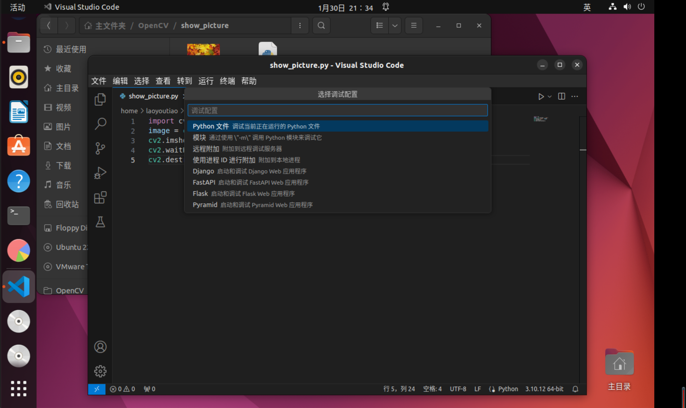

# OpenCV (分别使用c++语言和python语言实现)  

## 准备工作


### 任务清单：  
1、下载一张图片，使用imread读取，然后用imshow显示图片，了解如何改变输出图像的大小，并让图像分别完整显示在显示器的四个角。  
2、了解OpenCV处理单个像素和通道的方法，将一张彩色图片每个像素的RGB值改为三通道均值average。  
3、了解threshold函数原理，并手动实现，即在任务二的基础上，在最前面声明一个变量，遍历每一个像素，当average值大于变量值时设为255，反之为0，观察不同变量值处理结果。  
4、了解深拷贝与浅拷贝的区别，分别对同一图像进行深浅拷贝，并对拷贝后的图像进行任务三的处理，观察两者有什么区别。  
5、了解通道分离，将同一张彩色图片的三个通道分别分离。  
6、了解Gamma矫正原理（为什么、怎么做），并手动实现，使用图片见图6-1、6-2。  
7、了解HSV意义，将图片转化到HSV色域，并用inRange分别提取一张复杂彩色图片中红色和蓝色像素的部分，并思考在不同光线下参数应该怎么改。  

### 下载OpenCV：
手动安装源代码  
更新软件和软件源  
```
sudo apt-get update 
sudo apt-get upgrade 
```
安装依赖库  
```
sudo apt-get install build-essential libgtk2.0-dev libgtk-3-dev libavcodec-dev libavformat-dev libjpeg-dev libswscale-dev libtiff5-dev
```
下载OpenCV源代码,从官网上下载source文件  
将文件解压缩到Codes文件夹中，并重命名为opencv  
进入到下载好的opencv目录中，新建目录build并进入build目录  
```
cd opencv
mkdir build
cd build
```
编译debug模式opencv库文件  
```
cmake -D CMAKE_BUILD_TYPE=Debug -D OPENCV_GENERATE_PKGCONFIG=YES -D CMAKE_INSTALL_PREFIX=/usr/local/OpenCV/Debug -D WITH_FFMPEG=ON ..
```  
编译安装OpenCV，使用make编译  
```
make -j8
```
使用make安装  
```
sudo make install
```

:x:安装过程中出错了,报错设备上空间不够，但是我明明划了100GB的磁盘空间  

打开磁盘资源管理器，看一下是根文件夹不足，为什么主文件夹只有2.7GB  
下载安装gparted来进行磁盘管理  
```
sudo apt update
sudo apt install gparted
```
打开gparted
```
sudo gparted
```
通过gparted发现又80GB的空间未分配，尝试扩大主文件夹，报错  
```
unable to resize read-only file system /dev/sda3
The file system can not be realized while it is mounted read-only.
Either unmount the file system or remount it read-write
```
无法调整只读文件系统/dev/sda3的大小  
使用lsof命令来检查确认没有任何正在使用/dev/sda3文件系统的进程  
```
sudo lsof | grep /dev/sda3
```
使用umount命令来卸载/dev/sda3文件系统：
```
sudo umount /dev/sda3
```
使用mount命令将/dev/sda3文件系统重新挂载为读写模式
```
sudo mount -o remount,rw /dev/sda3
```
然后通过gparted扩大主文件夹  
成功了成功了成功了！:o::laughing::laughing::laughing:  


环境配置  
打开/etc/ld.so.conf  
```
sudo gedit /etc/ld.so.conf
```
在文件中加上一行  
```
include /usr/local/lib
```
加入缓存  
```
 sudo ldconfig
```
打开 /etc/bash.bashrc 文件  
```
sudo gedit /etc/bash.bashrc
```
末尾加上  
```
PKG_CONFIG_PATH=$PKG_CONFIG_PATH:/usr/local/lib/pkgconfig
export PKG_CONFIG_PATH
```
再输入命令  
```
source /etc/bash.bashrc
```
检验  
```
pkg-config opencv --modversion
```
会出现opencv的版本  
:x:但是报错:dizzy_face:  
```
Package opencv was not found in the pkg-config search path.
```
创建pkgconfig文件
```
cd /usr/local/lib
 
sudo mkdir pkgconfig
cd pkgconfig
sudo touch opencv.pc
sudo vim opencv.pc
```
进入vim模式插入代码   :qa! 不保存退出  :wq  保存退出
```
prefix=/usr/local
exec_prefix=${prefix}
includedir=${prefix}/include
libdir=${exec_prefix}/lib
 
Name: opencv
Description: The opencv library
Version:4.8.0
Cflags: -I${includedir}/opencv4
Libs: -L${libdir} -lopencv_shape -lopencv_stitching -lopencv_objdetect -lopencv_superres -lopencv_videostab -lopencv_calib3d -lopencv_features2d -lopencv_highgui -lopencv_videoio -lopencv_imgcodecs -lopencv_video -lopencv_photo -lopencv_ml -lopencv_imgproc -lopencv_flann  -lopencv_core
```
检验:o:  
```
pkg-config opencv --modversion
```
转到 opencv-4.5.2/sample/cpp/example_cmake 目录下，打开终端  
```
cmake .
make
./opencv_example
```
转到 opencv-4.5.2/sample/cpp/example_cmake 目录下，打开终端  
```
cmake .
make
./opencv_example
```
"Hello,OpenCV"安装成功:laughing:  

  

### 下载dlib：  
```c
pip install cmake  -i https://pypi.tuna.tsinghua.edu.cn/simple
pip install boost  -i https://pypi.tuna.tsinghua.edu.cn/simple
pip install dlib  -i https://pypi.tuna.tsinghua.edu.cn/simple
```
没了，安装dlib还挺顺利的  

### vscode配置C++环境  

安装vscode，没什么好说的
输入指令sudo apt-get install vim安装vim
sudo apt install g++安装g++
安装汉化、C\C++插件  

### 上传github 

之前一直放着没有解决的问题出现报错了  
当本地文件和github上的文件不一致时，push和pull时会报错  
```
$ git push -u origin main
To github.com:YuanJieMaster/Computer_Vision.git
 ! [rejected]        main -> main (non-fast-forward)
error: failed to push some refs to 'github.com:YuanJieMaster/Computer_Vision.git'
hint: Updates were rejected because the tip of your current branch is behind
hint: its remote counterpart. If you want to integrate the remote changes,
hint: use 'git pull' before pushing again.
hint: See the 'Note about fast-forwards' in 'git push --help' for details.

$ git pull origin main
From github.com:YuanJieMaster/Computer_Vision
 * branch            main       -> FETCH_HEAD
fatal: refusing to merge unrelated histories
```

解决方法：忽略差异，强制上传  
比较暴力，但是有用，这一块还值得研究，以后再说，先赶进度  
```
git pull origin main --allow-unrelated-histories

git push -u origin main
```


## OpenCV学习笔记  

### 1.5 快速上手OpenCV图片处理  


#### 1.5.1 图像显示  

用imread函数载入图像存储数据结构Mat类
用imshow函数显示  

```cpp
#include <opencv2/opencv.hpp>
using namespace cv; //包含cv命名空间  

int main()
{
    Mat Image = imread("./maple_leaf.jpg");  //载入图片
    imshow("origin_picture",Image); //显示图片
    waitKey(0); //等待任意按键按下，使窗口保持在那里
}
```

输入命令  
```
g++ show_picture.cpp -o show_picture `pkg-config --cflags --libs opencv`
./show_picture
```

效果图
 


#### 1.5.2 图像腐蚀  

最基本的形态学运算之一————腐蚀  
用暗色部分腐蚀掉高亮部分  

```cpp
#include <opencv2/highgui/highgui.hpp> //highgui模块头文件
#include <opencv2/imgproc/imgproc.hpp> //OpenCV图像处理头文件 
using namespace cv; //包含cv命名空间  

int main()
{
    Mat srcImage = imread("./maple_leaf.jpg");  //载入图片
    imshow("origin_picture",srcImage); //显示图片

    Mat element = getStructuringElement(MORPH_RECT,Size(15,15));
    Mat dstImage;
    erode(srcImage, dstImage, element);

    imshow("已腐蚀",dstImage);

    waitKey(0); //等待任意按键按下，使窗口保持在那里
}
```

```
g++ eroded_picture.cpp -o eroded_picture `pkg-config --cflags --libs opencv`
./eroded_picture
```

效果图



#### 1.5.3 图像模糊  

均值滤波  

```cpp
#include "opencv2/highgui/highgui.hpp"
#include "opencv2/imgproc/imgproc.hpp"
using namespace cv;

int main()
{
    Mat srcImage = imread("./maple_leaf.jpg");
    imshow("origin_picture", srcImage);
    Mat dstImage;
    blur(srcImage, dstImage, Size(7,7));
    imshow("blured_picture", dstImage);
    waitKey(0);
}
```


## OpenCV任务

### 1、下载一张图片，使用imread读取，然后用imshow显示图片，了解如何改变输出图像的大小，并让图像分别完整显示在显示器的四个角。  

#### C++代码  

##### （1）用imshow显示图片  

代码
```cpp
#include <opencv2/opencv.hpp>

int main() {
    // 导入图像
    cv::Mat image = cv::imread("maple_leaf.jpg");

    // 检查图像是否成功加载
    if (image.empty()) {
        std::cout << "无法加载图像" << std::endl;
        return -1;
    }

    // 创建一个窗口并显示图像
    cv::namedWindow("Image", cv::WINDOW_NORMAL);
    cv::imshow("Image", image);

    // 等待按键
    cv::waitKey(0);

    // 销毁窗口
    cv::destroyAllWindows();

    return 0;
}
```

```
./show_picture.cpp
```
```
bash: ./show_picture.cpp: 权限不够
```
使用以下命令为文件添加执行权限：
```
chmod +x show_picture.cpp
```
报错  
```
./show_picture.cpp: 行 3: 未预期的记号 "(" 附近有语法错误
./show_picture.cpp: 行 3: `int main() {'
```
在vscode中运行  
报错  
```
/usr/bin/ld: /tmp/ccgxhwqV.o:(.data.rel.local.DW.ref.__gxx_personality_v0[DW.ref.__gxx_personality_v0]+0x0): undefined reference to `__gxx_personality_v0'
/usr/bin/ld: warning: creating DT_TEXTREL in a PIE
collect2: error: ld returned 1 exit status
```
在命令行中将其编译成可执行文件  
直接采用  
```
g++ show_picture.cpp -o show_picture 
```
会出错，因为没有连接到OpenCV库，  
需要在编译命令中添加OpenCV库的链接选项
```
g++ show_picture.cpp -o show_picture `pkg-config --cflags --libs opencv`
```
运行编译后的可执行文件：  
```
./show_picture
```
成功


##### （2）改变输出图像的大小

```cpp
#include <opencv2/opencv.hpp>

int main() {
    // 读取图像
    cv::Mat image = cv::imread("./maple_leaf.jpg");

    // 设置新的宽度和高度
    int new_width = 300;
    int new_height = 200;

    // 使用resize函数调整图像大小
    cv::Mat resized_image;
    cv::resize(image, resized_image, cv::Size(new_width, new_height));

    // 显示调整后的图像
    cv::imshow("Resized Image", resized_image);
    cv::waitKey(0);
    cv::destroyAllWindows();

    return 0;
}
```
编译
```
g++ change_picture_size.cpp -o change_picture_size `pkg-config --cflags --libs opencv`
```
运行
```
./change_picture_size
```

效果图


##### （3）让图像分别完整显示在显示器的四个角

```cpp
#include <opencv2/opencv.hpp>

int main() {
    // 读取图像
    cv::Mat image = cv::imread("./maple_leaf.jpg");

    int screen_width = 1920; 
    int screen_height = 1080; 

    // 左上角
    cv::Mat top_left = image(cv::Rect(0, 0, screen_width, screen_height));
    cv::namedWindow("Top Left", cv::WINDOW_NORMAL);
    cv::moveWindow("Top Left", 0, 0);  // 左上角
    cv::imshow("Top Left", top_left);
    cv::resizeWindow("Top Left", top_left.cols, top_left.rows);  // 调整窗口大小

    // 右上角
    cv::Mat top_right = image(cv::Rect(image.cols - screen_width, 0, screen_width, screen_height));
    cv::namedWindow("Top Right", cv::WINDOW_NORMAL);
    cv::moveWindow("Top Right", screen_width - top_right.cols, 0);  // 右上角
    cv::imshow("Top Right", top_right);

    // 左下角
    cv::Mat bottom_left = image(cv::Rect(0, image.rows - screen_height, screen_width, screen_height));
    cv::namedWindow("Bottom Left", cv::WINDOW_NORMAL);
    cv::moveWindow("Bottom Left", 0, screen_height - bottom_left.rows);  // 左下角
    cv::imshow("Bottom Left", bottom_left);

    // 右下角
    cv::Mat bottom_right = image(cv::Rect(image.cols - screen_width, image.rows - screen_height, screen_width, screen_height));
    cv::namedWindow("Bottom Right", cv::WINDOW_NORMAL);
    cv::moveWindow("Bottom Right", screen_width - bottom_right.cols, screen_height - bottom_right.rows);  // 右下角
    cv::imshow("Bottom Right", bottom_right);

    cv::waitKey(0);
    cv::destroyAllWindows();

    return 0;
}
```

编译  
```
g++ four_pictures.cpp -o four_pictures `pkg-config --cflags --libs opencv`
```
运行
```
./four_pictures
```

报错
```
terminate called after throwing an instance of 'cv::Exception'
  what():  OpenCV(4.8.0) /home/laoyoutiao/Codes/opencv/modules/core/src/matrix.cpp:808: error: (-215:Assertion failed) 0 <= roi.x && 0 <= roi.width && roi.x + roi.width <= m.cols && 0 <= roi.y && 0 <= roi.height && roi.y + roi.height <= m.rows in function 'Mat'

已放弃 (核心已转储)

```
这个错误通常是由于提供的矩形区域超出了图像的边界所引起的。


函数原型：
Mat imread( const String& filename, int flags )
第一个参数表示图片的路径  
第二个参数表示读取的方式：  
-1表示读取原图（默认）  
0表示灰度图片  
1表示以RGB方式读取原图  
flags表：  
enum ImreadModes {
       IMREAD_UNCHANGED            = -1, //如果设置，则返回的数据带有alpha通道（R,G,B,A 四个通道），否则没有alpha通道  
       IMREAD_GRAYSCALE            = 0,  //如果设置，则将图像转换为单通道灰度图像  
       IMREAD_COLOR                = 1,  //如果设置，则将图像转换成3通道BGR彩色图像  
       IMREAD_ANYDEPTH             = 2,  //如果设置，则在输入具有相应深度时返回16位/32位图像，否则将其转换为8位  
       IMREAD_ANYCOLOR             = 4,  //如果设置，则图像可能以任何颜色格式读取  
       IMREAD_LOAD_GDAL            = 8,  //如果设置，使用gdal驱动程序加载图像  
       IMREAD_REDUCED_GRAYSCALE_2  = 16, //如果设置，总是将图像转换为单通道灰度图像且图像大小减少1/2  
       IMREAD_REDUCED_COLOR_2      = 17, //如果设置，总是将图像转换为3通道BGR彩色图像且图像大小减少1/2  
       IMREAD_REDUCED_GRAYSCALE_4  = 32, //如果设置，总是将图像转换为单通道灰度图像且图像大小减少1/4  
       IMREAD_REDUCED_COLOR_4      = 33, //如果设置，总是将图像转换为3通道BGR彩色图像且图像大小减少1/4  
       IMREAD_REDUCED_GRAYSCALE_8  = 64, //如果设置，总是将图像转换为单通道灰度图像且图像大小减少1/8  
       IMREAD_REDUCED_COLOR_8      = 65, //如果设置，总是将图像转换为3通道BGR彩色图像且图像大小减少1/8  
       IMREAD_IGNORE_ORIENTATION   = 128 //如果设置，不会根据EXIF的方向标志旋转图像  
     };
    
#### python代码  

void cv::imshow ( const String & winname,InputArray mat)

##### （1）用imshow显示图片  

代码  
```py
import cv2   //导入opencv库
image = cv2.imread('./maple_leaf.jpg')   //文件相对路径，当前目录下
cv2.imshow('Image', image)
cv2.waitKey(0)    //
cv2.destroyAllWindows()
```


轻松拿下！！:laughing:


##### （2）改变输出图像的大小

函数原型：
```py
cv2.resize(src, dsize[, dst[, fx[, fy[, interpolation]]]])
```


##### （3）让图像分别完整显示在显示器的四个角

第一版代码
```py
import cv2

# 读取图像
image = cv2.imread('./maple_leaf.jpg')

screen_width = 1920 
screen_height = 1080 

# 左上角
top_left = image[:screen_height, :screen_width]
cv2.namedWindow('Top Left', cv2.WINDOW_NORMAL)
cv2.moveWindow('Top Left', 0, 0)  # 左上角
cv2.imshow('Top Left', top_left)

# 右上角
top_right = image[:screen_height, -screen_width:]
cv2.namedWindow('Top Right', cv2.WINDOW_NORMAL)
cv2.moveWindow('Top Right', screen_width - top_right.shape[1], 0)  # 右上角
cv2.imshow('Top Right', top_right)

# 左下角
bottom_left = image[-screen_height:, :screen_width]
cv2.namedWindow('Bottom Left', cv2.WINDOW_NORMAL)
cv2.moveWindow('Bottom Left', 0, screen_height - bottom_left.shape[0])  # 左下角
cv2.imshow('Bottom Left', bottom_left)

# 右下角
bottom_right = image[-screen_height:, -screen_width:]
cv2.namedWindow('Bottom Right', cv2.WINDOW_NORMAL)
cv2.moveWindow('Bottom Right', screen_width - bottom_right.shape[1], screen_height - bottom_right.shape[0])  # 右下角
cv2.imshow('Bottom Right', bottom_right)

cv2.waitKey(0)
cv2.destroyAllWindows()

```

效果图


左上角的图片总是不能完全打开  
我原以为是因为几个窗口互相挨得太近所以自动调节了左上角图片的大小  
但是想想按照顺序应该是左上角的图片先打开才对  

最终版代码
```py
import cv2

# 读取图像
image = cv2.imread('./maple_leaf.jpg')

screen_width = 1920 
screen_height = 1080  

# 左上角
top_left = image[:screen_height, :screen_width]
cv2.namedWindow('Top Left', cv2.WINDOW_NORMAL)
cv2.moveWindow('Top Left', 0, 0)  # 左上角
cv2.imshow('Top Left', top_left)
cv2.resizeWindow('Top Left', top_left.shape[1], top_left.shape[0])  # 调整窗口大小 # 加了这一行  

# 右上角
top_right = image[:screen_height, -screen_width:]
cv2.namedWindow('Top Right', cv2.WINDOW_NORMAL)
cv2.moveWindow('Top Right', screen_width - top_right.shape[1], 0)  # 右上角
cv2.imshow('Top Right', top_right)

# 左下角
bottom_left = image[-screen_height:, :screen_width]
cv2.namedWindow('Bottom Left', cv2.WINDOW_NORMAL)
cv2.moveWindow('Bottom Left', 0, screen_height - bottom_left.shape[0])  # 左下角
cv2.imshow('Bottom Left', bottom_left)

# 右下角
bottom_right = image[-screen_height:, -screen_width:]
cv2.namedWindow('Bottom Right', cv2.WINDOW_NORMAL)
cv2.moveWindow('Bottom Right', screen_width - bottom_right.shape[1], screen_height - bottom_right.shape[0])  # 右下角
cv2.imshow('Bottom Right', bottom_right)

cv2.waitKey(0)
cv2.destroyAllWindows()

```
加上一行代码
```py
cv2.resizeWindow('Top Left', top_left.shape[1], top_left.shape[0])  # 调整窗口大小
```
用于调整左上角图片大小  

效果图


### 2、了解OpenCV处理单个像素和通道的方法，将一张彩色图片每个像素的RGB值改为三通道均值average。  


### 3、了解threshold函数原理，并手动实现，即在任务二的基础上，在最前面声明一个变量，遍历每一个像素，当average值大于变量值时设为255，反之为0，观察不同变量值处理结果。  


### 4、了解深拷贝与浅拷贝的区别，分别对同一图像进行深浅拷贝，并对拷贝后的图像进行任务三的处理，观察两者有什么区别。  


### 5、了解通道分离，将同一张彩色图片的三个通道分别分离。  


### 6、了解Gamma矫正原理（为什么、怎么做），并手动实现，使用图片见图6-1、6-2。  


### 7、了解HSV意义，将图片转化到HSV色域，并用inRange分别提取一张复杂彩色图片中红色和蓝色像素的部分，并思考在不同光线下参数应该怎么改。  


